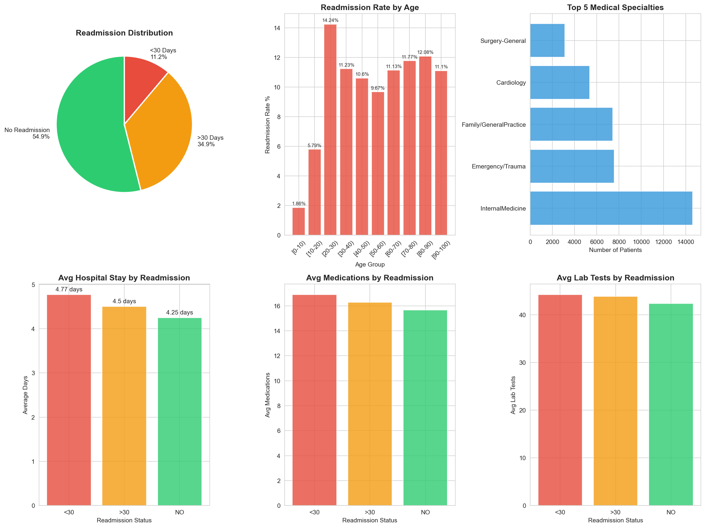

#  Hospital Readmission Analysis
### Healthcare Data Analysis Project

Analysis of 101,766 diabetic patient records from 
130 US hospitals using Python, SQL, and data visualization.

---

##  Project Overview
- **Dataset:** 101,766 patients | 50 features | 10 years
- **Goal:** Identify factors driving 30-day readmissions
- **Tools:** Python, Pandas, SQLite, Matplotlib, Seaborn

---

##  SQL Queries Used
- Total patient count
- Readmission breakdown by category
- Average stay & medications by readmission status
- Top 10 busiest medical specialties
- Readmission rate by age group

---

##  Key Findings

| Metric | Value |
|---|---|
| Total Patients | 101,766 |
| Critical Readmissions (<30 days) | 11.16%  |
| Readmitted after 30 days | 34.93% |
| No Readmission | 53.91%  |

### High Risk Groups:
| Age Group | Readmission Rate |
|---|---|
| 20-30 years | 14.24%  Highest |
| 80-90 years | 12.08% |
| 70-80 years | 11.77% |
| 0-10 years  | 1.86%  Lowest |

### Sickest Patients (readmitted <30 days):

Average hospital stay : 4.77 days
Average medications   : 16.9
Average lab tests     : 44.2

---

##  Visualizations


---

##   Clinical Recommendations

1.Focus prevention on young adults (20-30)
2.Monitor patients with >15 medications closely
3.Strengthen discharge protocols in Internal Medicine department
4.Early follow-up for high-risk patients


---

##  How to Run
```bash
pip3 install pandas numpy matplotlib seaborn
python3 readmission_analysis.py
```

---

##  Dataset
- Source: UCI ML Repository via Kaggle
- 130 US hospitals | 1999-2008
- 101,766 encounters | 50 features

---

##   Author
Medical Student & Healthcare Data Analyst  
Using data science to improve patient outcomes
